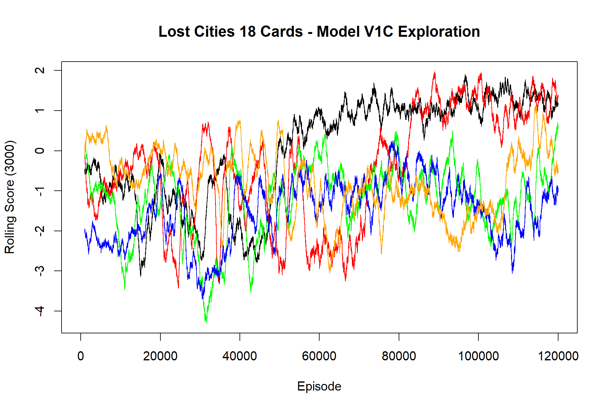

# lost_cities
Reinforcement Learning For Lost Cities

This project used tensorflow in python in order to build an actor-critic NN to play a reduced size version of Lost Cities.
I am starting out with 3 colors and a total of 18 cards; then I'll scale up to 4 colors and 32 cards.
When successful, the plan is to create a playing agent for the full Lost Cities game with 60 cards.

I'm seeking individuals who would like to collaborate on this project.

FIRST MODEL - V1C

I have a working version running and it is able to learn how to play the game. Not great, but nonetheless, it can play somewhat well.
Now, the goal is to collaborate with others on this version aimed at the reduced size 18 card game of Lost Cities.

I have currently set up the learning to be 60,000 episodes where both players P1 and P2 use the actor-critic two-head model.
The two heads are for the "play" action (which card to play where) and the "draw" choice (to draw from deck or center piles).

The parameters I've been tuning are:
- episode_booster - how much weight to apply to the final game score
- step_booster - how much weight to apply to the "step_reward" recognized at each play
- train_every - how frequently to train the model (using saved episodes, small batches, with a limit on storage)

The black curve represents the best performing bot so far:
- episode_booster=0.50
- step_booster=5.0
- train_every=2

You can see all the other parameters in the training cell.
