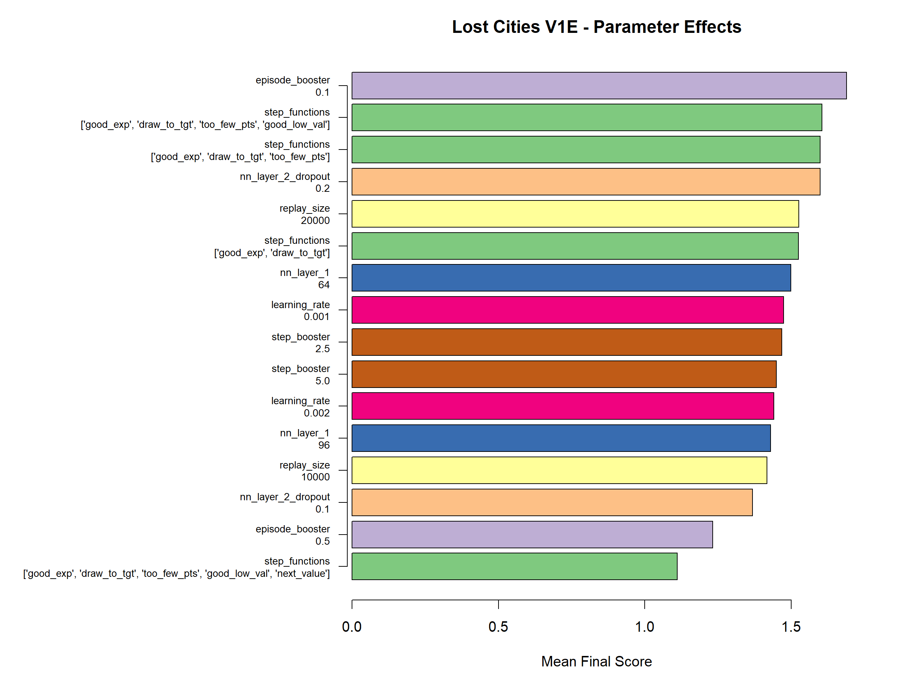
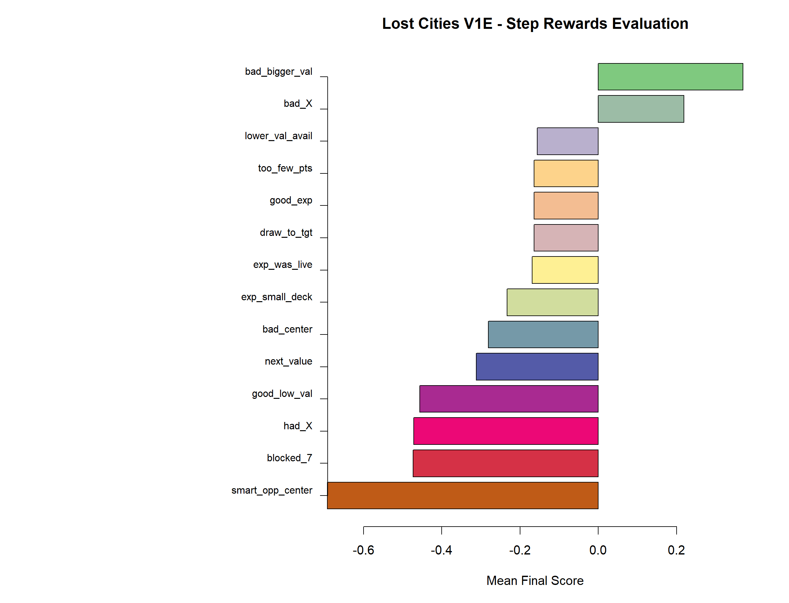
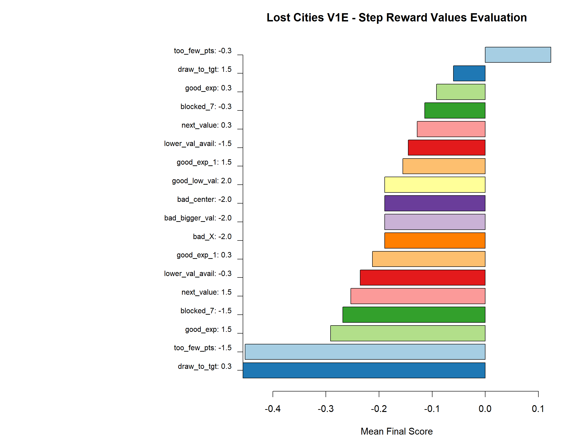

## Reinforcement Learning For Lost Cities - Version V1ES

## GRID SEARCH - Version V1ES

I re-factored the code to put all the basic setup and functions in the file V1E_main.py and then to put the training in a notebook.
The training is now in a function, and there is a grid search (hence the S) loop that explores 256 combinations of parameters.
There are 3 grid searches:
1. setup and NN
2. step reward inclusions
3. step reward values

# Grid Search #1
Under consideration here for setup are:
* nn_layer_1 = neurons in layer 1 of the NN (nn_layer_2 is fixed at size 32)
* nn_layer_2_dropout = dropout rate in layer 2 of the NN
* learning_rate = 0.001 or 0.0005
* replay_size = 10000 or 20000
* episode_booster = 0.1 or 0.5, for the final game score boosting, then added back to the step rewards
* step_booster = 2.5 or 5.0, for the step_reward at each step (max value 2.0 from the function)
* step_function = 4 sets under consideration

I used the final 20,000 scores from each grid training output final scores (100,000 total) as the benchmark to look to see, which aspects of the training are having the best impact on raising the bot scores.

<pre>
                   var                                                                    value     n      mean
===============================================================================================================
 1:     step_functions                               ['good_exp', 'draw_to_tgt', 'too_few_pts']     4 1.5104250
 2:       step_booster                                                                      5.0     7 1.1969714
 3:    episode_booster                                                                      0.1    12 1.1774708
 4:         nn_layer_1                                                                       96    12 1.0911333
 5:        replay_size                                                                    20000     4 1.0787250
 6:     step_functions ['good_exp', 'draw_to_tgt', 'too_few_pts', 'good_low_val', 'next_value']     4 1.0786000
 7: nn_layer_2_dropout                                                                      0.1    10 1.0723550
 8:      learning_rate                                                                    0.001    20 1.0715600
 9: nn_layer_2_dropout                                                                      0.2    10 1.0707650
10:        replay_size                                                                    10000    16 1.0697687
11:         nn_layer_1                                                                       64     8 1.0422000
12:       step_booster                                                                      2.5    13 1.0040308
13:     step_functions                                              ['good_exp', 'draw_to_tgt']     8 0.9229812
14:     step_functions               ['good_exp', 'draw_to_tgt', 'too_few_pts', 'good_low_val']     4 0.9228125
15:    episode_booster                                                                      0.5     8 0.9126937
</pre>

Here is a bar plot to get some idea about the parameter value impacts.

This indicates that those 3 particular step reward helpers are best, especially compared to the other sets. However, using all 5 helpers might be ok (line 6).
The step_booster is definitely better at 5.0.  NN layer 1 is best with 96 neurons (should I try 128 now?).  The replay size at 20000 or 10000 is close, but
my inclination is to even try a larger replay sizing.  I will seek other metrics by which to compare the grid features to determine which are the best values.

Here is the final scores, grouped 500 at a time, for the top 8 configs from the grid search (so far).  This gives a visual on how the RI progresses in learning
for some of the top grid combinations.

# Grid Search #2
Here I focus on which of the step rewards I defined have the best impact on achieving higher scores. I fixed 3 of the rewards as always included, then train 55 times to capture adding all combinations of 0, 1, or 2 of the other 10 step reward rules. (1+10+45).

# Grid Search #3
Now the intent is determine, at least directionally, if small or large step rewards are beneficial for the step rewards. I fixed 3 of the reward values as always included, in order to reduce the search space, then train 128 times to explore small vs. large rewards for 7 rewards.
<pre>
reward_grid = {
    "good_exp":        [0.3, 1.5],
    "good_exp_1":      [0.3, 1.5],    
    "draw_to_tgt":     [0.3, 1.5],
    "too_few_pts":     [-1.5, -0.3],
    "bad_X":           [-2.0],
    "bad_center":      [-2.0],
    "good_low_val":    [2.0],
    "bad_bigger_val":  [-2.0],
    "next_value":      [0.3, 1.5],
    "blocked_7":       [-1.5, -0.3],
    "lower_val_avail": [-1.5, -0.3]
}  
</pre>

